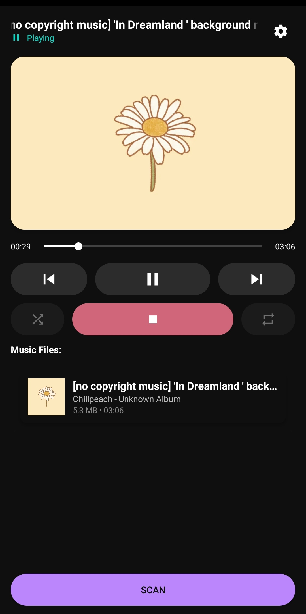
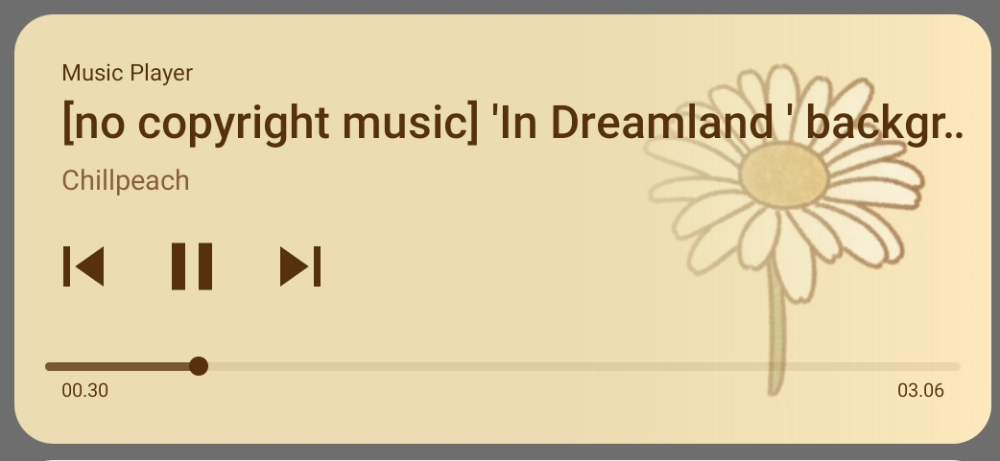

# Music Player Android

<p align="center">
    
    
</p>

A native Android music player application with a simple interface and high performance using OpenSL ES for audio playback.

## 🎵 Key Features

- **Native Audio Playback**: Uses OpenSL ES (C/C++) for optimal audio performance
- **Complete Metadata**: Displays song title, artist, album, and album art
- **Playback Controls**: Play, pause, stop, previous, next with interactive seekbar
- **Playback Modes**:
  - Shuffle
  - Repeat all
  - Repeat one
  - Repeat off
- **Auto-scan**: Automatically scans music files when the app opens
- **Notification Controls**: Control playback from the notification bar
- **Foreground Service**: Music continues playing in background
- **Logging System**: File logging for debugging and monitoring
- **Permission Management**: Proper storage access permission handling
- **Settings**: Configure scan directory, auto-scan, and log level

## 📋 Supported Audio Formats

- MP3
- WAV
- OGG
- M4A
- AAC
- FLAC
- WMA
- OPUS
- 3GP

## 🏗️ Architecture

### Java Layer
- **MainActivity**: Main activity with UI and playback controls
- **SettingsActivity**: Settings configuration activity
- **MusicService**: Foreground service for music playback
- **PlayerController**: Bridge between Java and native C library
- **MusicScanner**: Scans and extracts metadata from music files
- **ConfigManager**: Application configuration management
- **FileLogger**: System logging to file
- **BitmapCache**: Album art caching for performance
- **CrashHandler**: Handles and logs application crashes

### Native C Layer (JNI)
- **audio_player.c**: Audio player implementation using OpenSL ES
- **jni_wrapper.c**: JNI wrapper for Java-C communication
- **audio_player.h**: Header file with interface definitions

## 🔧 Requirements

- **Minimum SDK**: Android 5.0 (API Level 21)
- **Target SDK**: Android 13+ (API Level 33+)
- **NDK**: Required for native library compilation
- **CMake**: 3.10.2 or newer
- **Permissions**:
  - READ_EXTERNAL_STORAGE
  - READ_MEDIA_AUDIO (Android 13+)
  - FOREGROUND_SERVICE
  - FOREGROUND_SERVICE_MEDIA_PLAYBACK
  - POST_NOTIFICATIONS

## 🚀 Build Instructions

### Using Android Studio

1. Clone or download the project
2. Open project in Android Studio
3. Make sure NDK and CMake are installed:
   - Tools → SDK Manager → SDK Tools
   - Check "NDK (Side by side)" and "CMake"
4. Sync Gradle files
5. Build project: Build → Make Project
6. Run on device/emulator

### Build from Command Line

```bash
# Build APK
./gradlew assembleDebug

# Install to device
./gradlew installDebug
```

## 📂 Project Structure

```
MusicPlayer/
├── java/com/music/player/          # Java source code
│   ├── MainActivity.java           # Main activity
│   ├── SettingsActivity.java       # Settings activity
│   ├── MusicService.java           # Background service
│   ├── PlayerController.java       # JNI controller
│   ├── MusicScanner.java           # Music file scanner
│   ├── MusicFile.java              # Music data model
│   ├── MusicFileAdapter.java       # RecyclerView adapter
│   ├── ConfigManager.java          # Config management
│   ├── FileLogger.java             # System logging
│   ├── BitmapCache.java            # Image cache
│   ├── CrashHandler.java           # Crash handler
│   ├── PermissionHelper.java       # Permission helper
│   ├── ScanResultHandler.java      # Scan result handler
│   └── Constant.java               # Constants
├── c/                              # Native C code
│   ├── audio_player.c              # OpenSL ES implementation
│   ├── audio_player.h              # Header file
│   ├── jni_wrapper.c               # JNI wrapper
│   └── CMakeLists.txt              # CMake build config
├── res/                            # Android resources
│   ├── layout/                     # XML layouts
│   ├── drawable/                   # Icons & graphics
│   ├── values/                     # Strings & colors
│   └── mipmap/                     # App icons
├── AndroidManifest.xml             # Application manifest
└── play_store_512.png              # App icon
```

## ⚙️ Configuration

The app stores configuration in SharedPreferences with options:

- **Scan Directory**: Music folder location (default: /storage/emulated/0/Music)
- **Auto Scan**: Automatically scan when app opens
- **Load Album Art**: Load album artwork (affects performance)
- **Log Level**: Logging level (DEBUG, INFO, WARNING, ERROR)

Access settings through the Settings button in MainActivity.

## 🎯 Usage

1. **First time opening**: Grant storage access permission
2. **Scan music**: Press "SCAN" button or use auto-scan
3. **Select song**: Tap on a song in the list
4. **Playback controls**:
   - Play/Pause: Center button
   - Previous/Next: Side buttons
   - Seek: Slide the seekbar
   - Shuffle: Toggle shuffle mode
   - Repeat: Toggle repeat mode (repeat all → repeat one → off)
5. **Background playback**: Minimize app, music keeps playing
6. **Notification controls**: Control from notification bar

## 🐛 Debugging

Log files are stored at:
```
/storage/emulated/0/Android/data/com.music.player/files/log.txt
```

Log file format: `musicplayer_YYYYMMDD.log`

To view logs in real-time:
```bash
adb logcat | grep -E "MainActivity|AudioPlayer|MusicService"
```

## 📝 Development Notes

### OpenSL ES
- Low-latency audio playback
- Direct audio buffer manipulation
- Efficient for music and game audio

### Service Architecture
- Foreground service for continuous playback
- Notification with media controls
- Proper lifecycle management

### Memory Management
- Bitmap caching to avoid OOM
- Proper cleanup in onDestroy
- Efficient metadata extraction

## 🤝 Contributing

Contributions are welcome! Please:
1. Fork the repository
2. Create a feature branch (`git checkout -b new-feature`)
3. Commit your changes (`git commit -am 'Add new feature'`)
4. Push to the branch (`git push origin new-feature`)
5. Create a Pull Request

## 📄 License

[MIT](LICENSE)

## 🔗 Dependencies

### Native Libraries
- OpenSL ES (Android System)
- Android NDK

### Java Libraries
- AndroidX AppCompat
- Android MediaMetadataRetriever
- Android MediaSession (for notification controls)

## 🚨 Known Issues

- Some files with corrupted metadata may not be scanned
- High-resolution album art can cause lag on low-end devices
- Shuffle mode uses the same random seed each session
- Auto scan may not worked some time

## 👨‍💻 Developer Notes

### Adding New Audio Format
Edit the `MusicScanner.AUDIO_EXTENSIONS` array in `MusicScanner.java`

### Custom Themes
Edit colors in `res/values/colors.xml`
